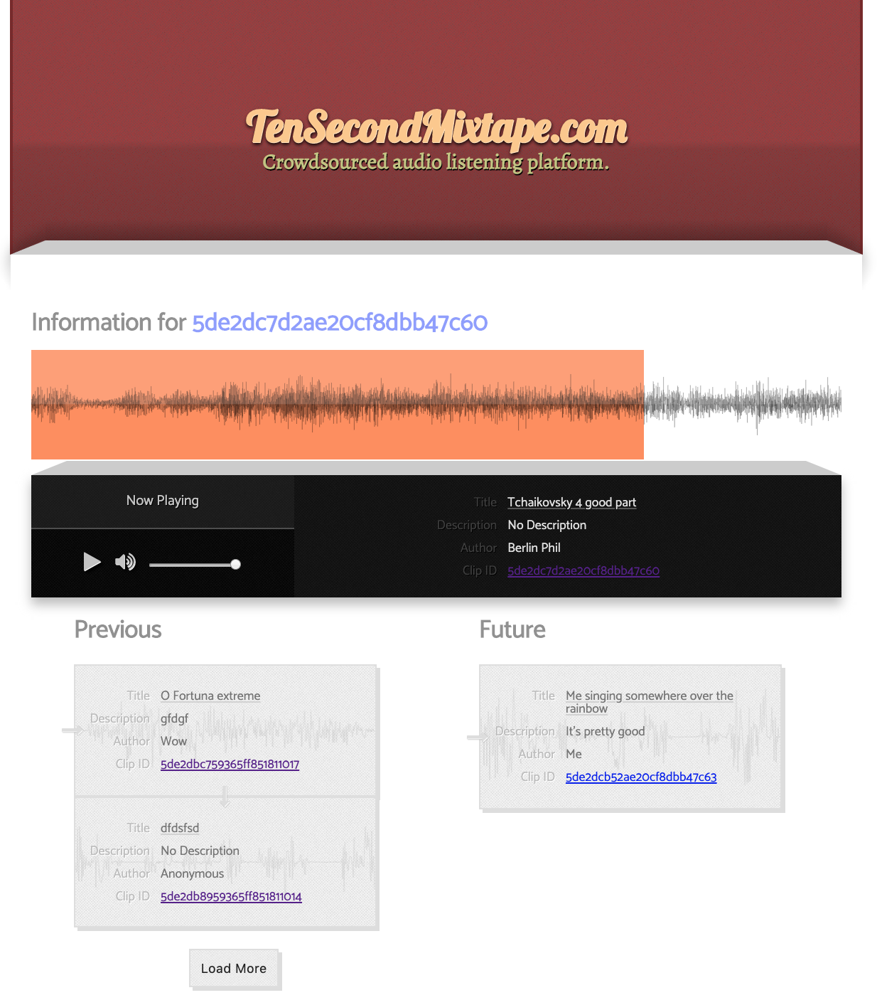

Development servers. 
-------------------

- Run the mongodb daemon. `mkdir data; mongod --dbpath=./data`

- Run `npm run dev-server` for a nodemon backend auto-refresh.

- (Optional) Run `npm run dev-client` for a hot webpack dev server, for frontend development.

- API calls (of the form www.website.com/api/*) are proxied from the `dev-client` server to the `dev-server` server. Generally, just run both servers concurrently for development and connect on port 8080 as configured.

Production server.
----------------

Simply run `node app.js`.
